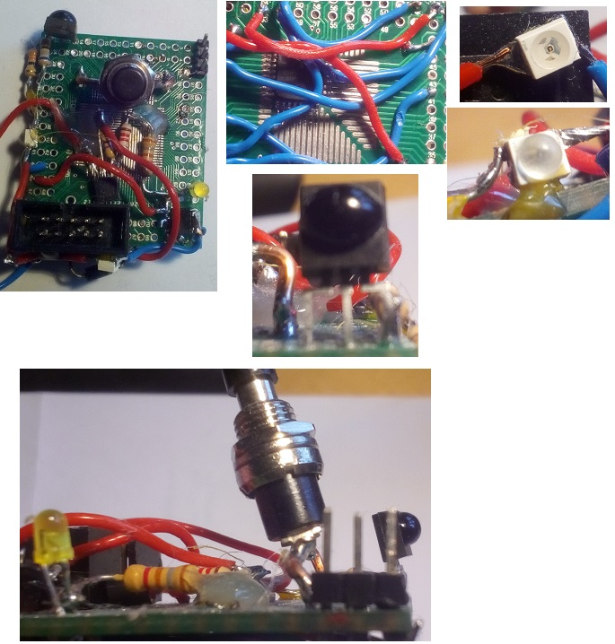

# IR Remote Control Code Translator and IR-Blaster Device

## AVR ATMEGA-48PA embedded C code Project

- translates your IR remote control commands to most modern device codes.

- uses two IR LEDs to boost output.

## History

For a long time i was using a bunch of remotes to control the SatReceiver, the TV, the Stereo.....  
Many remotes have so small buttons you cant manage in the dark.

There are "learning" remote controls, however most do not always work as desired.

That raised the desire to develop a **code translater device** that will be able to 
- turn On and Off multible devices on one command
- use only one IR remote for all my devices, at least for most of the frequently commands.

## The Translator
- i used the Atmega44pa as it was already available in my lab.
- its all interrupt driven so power friendly
- it can learn codes and store them in its flash memory, even mutlible codes to switch multible devices On/Off.
- it receives an ircode and looks it up in a codetable to find the replacement codes to send.
- it sends replacement codes (up to 3)
- i fitted two IR LEDs to improve transmission range

## Fotos
OK, its just an ugly lab protoype :-)

## Compile
I worked on Windows, for Linux there are also compiler packages available.  
i used the AVR-GCC package from https://gnutoolchains.com/avr/  
works very good  
The code is small, just about 2K Bytes.  
There is a **makefile** for easy usage.  
make  = compile  
make flash = flash with avrdude  

## Other
I added a **hex-file** so you can flash it right away.

And yes, programably write to flash in Atmega works! _flash_write_page_  

you need a programmer like the **USBASP** to work together with **avrdude**. (see makefile)  
I added *avrdude* which need to be copied to the ....bin directory to be in the default command-PATH.  
Also added a *schematic* so you can build it yourself.  

have fun, Xenpac